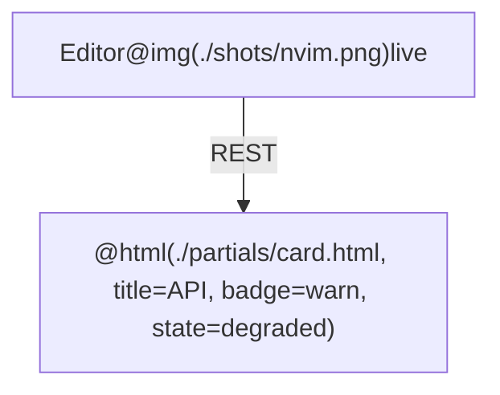

# zen-diagram

`zen-diagram` renders mermaid to SVG/PNG/PDF with a catppuccin theme, and — the
reason it exists — inlines local screenshots and custom HTML into diagram nodes.
It lives in the dotfiles repo at `mermaid/` and is on PATH via `./link-bin`.

**Every failure mode below is silent.** Mermaid does not error on a truncated
label, an unstripped comment, or an image that never loaded — it renders
something wrong-looking and exits 0. So the rules are not style advice, and the
verification step is not optional.

## Commands

```sh
zen-diagram arch.mmd              # -> arch.svg beside the source
zen-diagram arch.mmd -f png       # png (default scale 2, crisp)
zen-diagram a.mmd b.mmd --out-dir docs/img
zen-diagram watch arch.mmd        # rebuild on save; tracks images + partials too
zen-diagram new arch              # scaffold (--template basic|rich|sequence)
zen-diagram themes
zen-diagram --help
```

Useful flags: `-t zen-light`, `-b transparent`, `-w/--height`, `-s <scale>`,
`--css <file>`, `--config <file>`, `--pdf-fit`, `--no-project`.

**Prefer SVG** for docs and READMEs — sharp at any size, and assets are inlined
so the file stands alone. Use PNG when the target can't render SVG, or when you
need to look at the result yourself.

## Workflow

1. Collect the screenshots and data you need into an **ignored** assets
   directory — see below.
2. Write the `.mmd` next to where it will be used (`docs/`, or beside the README).
3. Render it.
4. **Read the rendered PNG back and actually look at it.** This is the only way
   to catch a clipped label, a missing screenshot, or an overlapping edge —
   none of which produce an error. If you rendered SVG, render a PNG too, just
   to inspect.
5. Fix and re-render until it reads correctly.

Any warning on stderr (`asset not found`, `@html partial not found`) means the
diagram rendered with that piece missing. Never report success over a warning.

## Working assets stay out of git

Screenshots, scrapes and intermediate files are **inputs, not deliverables**.
The rendered SVG/PNG has them base64-inlined, so it already stands alone —
committing the originals just duplicates them into the repo.

Put everything you gather in a `.diagram-assets/` directory beside the diagram,
and make sure it is ignored before writing anything into it:

```sh
mkdir -p docs/.diagram-assets
grep -qxF '.diagram-assets/' .gitignore || echo '.diagram-assets/' >> .gitignore
```

Then reference it relatively: `@img(./.diagram-assets/login.png)`.

Commit the `.mmd` and the rendered output. Do not commit the assets.

Two things to get right:

- **Don't put referenced assets in the session scratchpad.** It is
  session-scoped, so the `.mmd` breaks the next time anyone renders it.
- **Say the trade-off out loud when it bites.** A committed `.mmd` that points
  at ignored assets cannot be re-rendered from a clean checkout — the rendered
  output is the reproducible artifact. If the diagram needs to stay re-renderable
  by other people or by CI, tell the user and commit the assets instead.

## Embedding screenshots and HTML

Local assets are read and base64-inlined before mermaid sees them, so relative
paths work and the output is self-contained.

| Syntax | Result |
|---|---|
| `@img(./shot.png)` | screenshot, class `zen-shot` |
| `@icon(./logo.svg)` | icon sized to the text, class `zen-icon` |
| `@html(./card.html, title=Auth)` | HTML partial, `{{title}}` substituted |
| `` | plain HTML, also inlined |
| `A@{ img: "./shot.png" }` | mermaid v11 image shape, also inlined |

Extra attributes follow the path: `@img(./shot.png, class=zen-shot lg, alt=login)`.
Quote a value that contains a comma: `alt='one, two'`.

Paths resolve against the file they are written in — a path inside a partial
resolves against the **partial's** directory, not the diagram's.



## Rules that bite

1. **Single quotes only inside a label.** A `"` ends the mermaid label, so
   `<div class="x">` silently truncates the node. Partials get their double
   quotes rewritten automatically; hand-written labels do not.
2. **One line per label.** Wrap it in `["…"]`. Partials are collapsed for you.
3. **Never leave a bare `%%` line.** Mermaid only strips a comment with content
   after the marker; an empty one reaches the parser and fails the whole
   diagram with a confusing error on line 1. Write `%% -`, not `%%`.
4. **Directives inside `%%` comments are not expanded** — safe to comment one out.
5. **Escape `<` and `>` in visible text** as `&lt;` / `&gt;`, or it is parsed as
   a tag and vanishes.

## Styling

Classes from `themes/zen.css`, usable in any label:

- `zen-card` — vertical stack, the usual wrapper
- `zen-title`, `zen-sub`, `zen-muted` — text roles
- `zen-shot` (`.sm` / `.lg`), `zen-icon` — images
- `zen-badge` with `.ok` / `.warn` / `.err` / `.info` — status pills
- `zen-kv` — a `<table>` of key/value rows inside a node
- `zen-code` — inline monospace chip

Node outlines: `class A zen-accent-blue` (also `green`, `red`, `yellow`, `mauve`).

Keep labels lean. A node crammed with HTML makes the graph unreadable — reach
for `zen-kv` or a badge, not a paragraph.

## Theming a repo

Drop `.zen-diagram.json` (mermaid config, merged over the theme) or
`.zen-diagram.css` beside the diagram or anywhere above it. Both are picked up
with no flags, nearest file winning.

```json
{ "themeVariables": { "nodeBorder": "#ff8800", "mainBkg": "#2a1f1a" } }
```

Flowchart node borders come from `nodeBorder`, not `primaryBorderColor` — that
one is a common wrong guess that appears to do nothing.

## When something looks wrong

- **Label content cut off at the bottom** — custom CSS reached the page after
  mermaid measured the label. Theme CSS must go through mermaid's `themeCSS`
  (the renderer already does this); a stray `myCSS` path would reintroduce it.
- **"Maximum text size in diagram exceeded"** — `maxTextSize` too low for the
  inlined base64. The renderer raises it automatically; if you see this, the
  config passed a smaller explicit value.
- **Parse error pointing at line 1** — almost always a bare `%%` line.
- **Screenshot missing, no error** — check stderr for `asset not found`; the
  path is resolved relative to the file it is written in.
- **Chrome won't launch** — set `PUPPETEER_EXECUTABLE_PATH`.
- **`zen-diagram: command not found`** — run `bun install` in `mermaid/`, then
  `./link-bin` from the dotfiles root.

Full details and the rationale for each workaround: `mermaid/README.md` in the
dotfiles repo.
