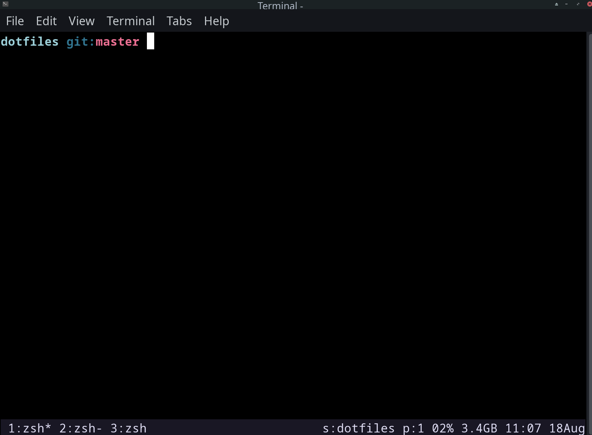
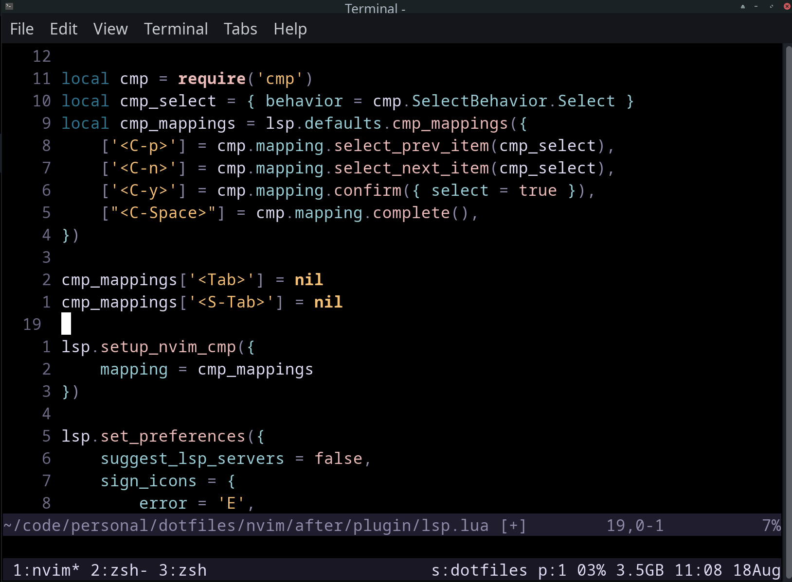
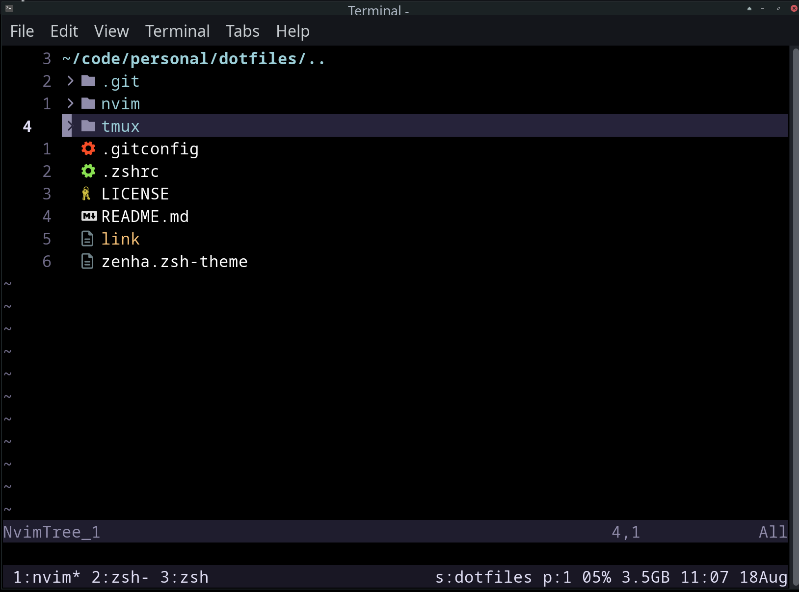

# dotfiles

- minimalistic
- [mocha theme](https://github.com/catppuccin/catppuccin)

### showcase:

-   https://github.com/webpro/awesome-dotfiles
-   https://github.com/ThePrimeagen/.dotfiles

### Requirements

- nvim  aur:neovim
    - packer
    - fzf
    - ripgrep
- gpg
- nerdfonts (Hack Nerd Font) aur:ttf-hack-nerd
- ohmyzsh
- alacritty

- i3
    - playerctl
