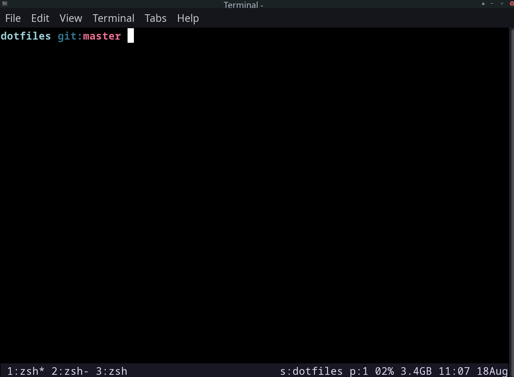
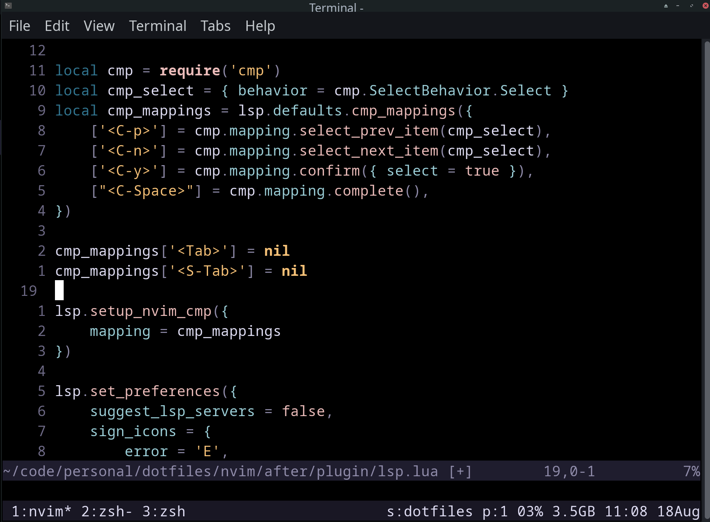
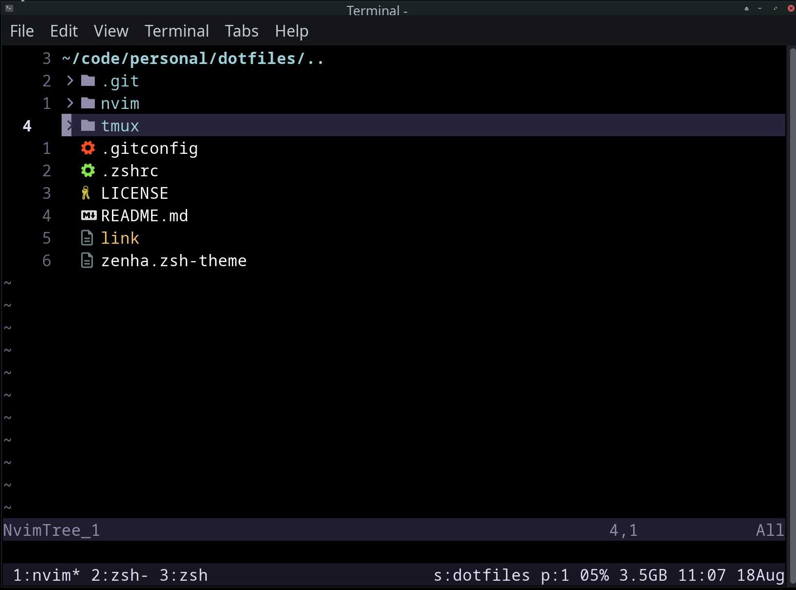

# dotfiles

- minimalistic
- [mocha theme](https://github.com/catppuccin/catppuccin)

### showcase:





- https://github.com/webpro/awesome-dotfiles
- https://github.com/ThePrimeagen/.dotfiles
- https://github.com/olimorris/dotfiles/blob/main/.config/nvim/lua/plugins/coding.lua

### Requirements

- nvim aur:neovim (uses lazy.nvim, self-bootstraps)
    - ripgrep
    - fzf
- gpg
- nerdfonts (Hack Nerd Font) aur:ttf-hack-nerd
- ohmyzsh
- alacritty
- mise (version manager)
- uv (python pkg manager)
- i3
    - playerctl

See `docs/wiki/manjaroi3/fresh-install.md` for full setup.

### Structure

```
alacritty/    # terminal emulator config
i3/           # i3 window manager config
nvim/         # neovim config (lua)
tmux/         # tmux config
zsh/          # zsh aliases, plugins, themes
.claude/      # Claude Code settings & skills
scripts/      # utility scripts (release, commit, run, ...)
```

### Other

##### Pull git submodules

`git submodule update --init --recursive`
