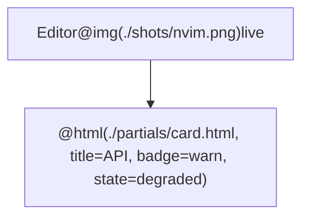

# zen-diagram

Themed mermaid renderer that runs on bun. Renders `.mmd` to SVG/PNG/PDF with a
catppuccin theme, and — the point of it — lets you put **screenshots and real
HTML** inside diagram nodes.

```sh
zen-diagram arch.mmd                 # -> arch.svg, next to the source
zen-diagram arch.mmd -f png          # -> arch.png
zen-diagram watch arch.mmd           # re-render on every save
zen-diagram new arch                 # scaffold from a template
zen-diagram themes                   # list built-in themes
zen-diagram --help
```

## Install

From the repo root:

```sh
cd mermaid && bun install
cd .. && ./link-bin                  # puts zen-diagram on PATH
```

Chrome is found automatically — `/usr/bin/google-chrome-stable` and friends on
Linux, `/Applications/Google Chrome.app/…` on macOS — and puppeteer falls back to
its own `channel: 'chrome'` lookup if none match, so an unlisted install still
works. puppeteer's bundled download is skipped. Override with
`PUPPETEER_EXECUTABLE_PATH`.

## Screenshots and custom HTML

Local assets are read and inlined as base64 data URIs before mermaid sees the
diagram. Two consequences worth knowing: relative paths work (they otherwise
would not — see *Why the preprocessor exists* below), and the output file is
self-contained, so you can move an SVG into `docs/` or a README without
dragging an image folder along.

| | |
|---|---|
| `@img(./shot.png)` | screenshot, class `zen-shot` |
| `@icon(./logo.svg)` | inline icon sized to the text, class `zen-icon` |
| `@html(./card.html, title=Auth)` | an HTML partial, `{{title}}` substituted |
| `` | plain HTML, also inlined |
| `A@{ img: "./shot.png" }` | mermaid v11 image shapes, also inlined |

Extra attributes go after the path — `@img(./shot.png, class=zen-shot lg,
alt=login screen)`. A quoted value may contain commas.



`examples/showcase.mmd` exercises every mechanism against the repo's own
screenshots; render it to see the result.

### Rules that bite

- **Single quotes only** inside a label. A `"` ends the mermaid label, so
  `<div class="x">` truncates the node. Included partials get their double
  quotes rewritten automatically, but hand-written labels do not.
- **One line per label.** Partials are collapsed to one line for you.
- **Never leave a bare `%%` line.** Mermaid only strips a comment that has
  content after the marker; an empty one reaches the parser and fails the whole
  diagram. Write `%% -` rather than `%%`.
- Directives inside `%%` comments are left alone, so you can comment one out
  without it still reading the file.

### Styling helpers

Classes defined in `themes/zen.css`, usable in any label:

`zen-card` `zen-title` `zen-sub` `zen-shot` (`.sm` / `.lg`) `zen-icon`
`zen-badge` (`.ok` / `.warn` / `.err` / `.info`) `zen-kv` `zen-code` `zen-muted`

Node outlines: `class A zen-accent-blue` — also `green`, `red`, `yellow`,
`mauve`.

## Themes

`zen` (catppuccin mocha, default) and `zen-light` (latte). A theme is a
`<name>.json` mermaid config plus an optional sibling `<name>.css`.

```sh
zen-diagram arch.mmd -t zen-light
zen-diagram arch.mmd -t ./my-theme.json     # your own
```

### Per-repo overrides

Drop a `.zen-diagram.json` or `.zen-diagram.css` beside the diagram (or anywhere
above it). Both are picked up automatically with no flags, merged over the
theme, nearest file winning. Good for one repo that wants its brand colours:

```json
{ "themeVariables": { "primaryBorderColor": "#ff8800" } }
```

Disable with `--no-project`.

## Options

```
-o, --out <path>       output file, or a directory for multiple inputs
    --out-dir <dir>    write outputs into <dir>, keeping base names
-f, --format <fmt>     svg | png | pdf                    (default: svg)
-t, --theme <name>     built-in theme or path to a config (default: zen)
-b, --background <c>   background colour, or "transparent"
-w, --width <px>       render viewport width              (default: 1400)
    --height <px>      render viewport height             (default: 900)
-s, --scale <n>        device pixel ratio for png          (default: 2)
    --css <file>       extra CSS appended to the theme
    --config <file>    extra mermaid config merged over the theme
    --pdf-fit          size the PDF page to the diagram
    --no-project       ignore .zen-diagram.json / .zen-diagram.css
```

`watch` re-renders on save. It tracks the diagram, every image and partial it
pulls in, and the theme files — touching a screenshot alone rebuilds.

## Why the preprocessor exists

mermaid-cli renders inside its own bundled `index.html` loaded over `file://`,
so a relative `src="./shot.png"` in a label resolves against the *package*
directory and silently 404s. Every local asset is therefore inlined as a data
URI before the definition is handed to mermaid.

Two related quirks the renderer works around, both of which produce silently
wrong output rather than an error:

- **CSS timing.** mermaid-cli's `myCSS` option appends a `<style>` to the SVG
  *after* `mermaid.render()` has measured every label. Any rule affecting layout
  lands too late, and labels overflow their `<foreignObject>` clip box — content
  visibly cut off. The theme stylesheet goes in through mermaid's `themeCSS`
  config instead, which is in the document before measurement.
- **`maxTextSize`.** One inlined screenshot is worth ~250KB of base64, well past
  mermaid's 50 000-character default, which renders as "Maximum text size in
  diagram exceeded". The limit is raised to fit the definition.

## Layout

```
src/cli.ts          arg parsing, render/watch/new/themes
src/preprocess.ts   directive expansion + asset inlining
src/render.ts       browser lifecycle, one diagram -> one file
src/theme.ts        theme + per-repo config resolution
themes/             zen.json/.css, zen-light.json/.css
templates/          scaffolds for `zen-diagram new`
examples/           showcase using the repo's own screenshots
test/               `bun test`
```
